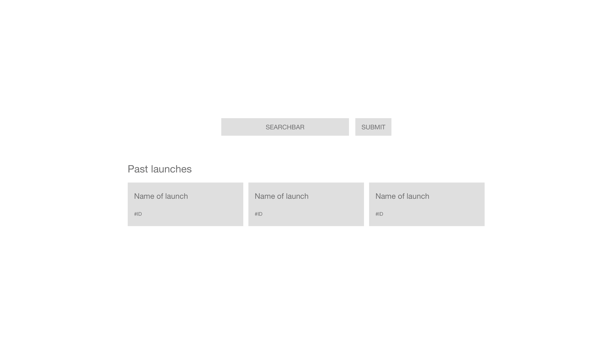
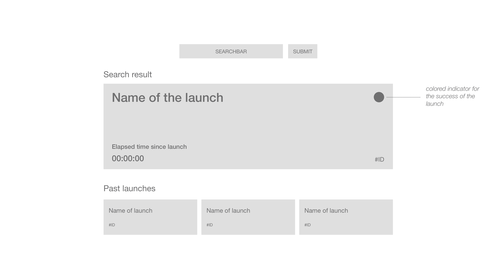
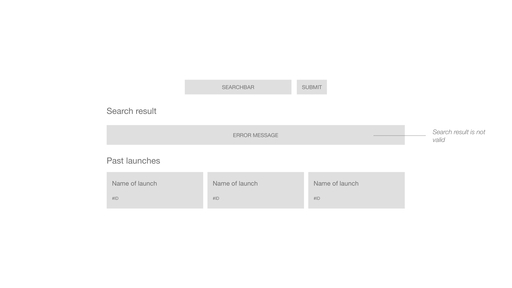

# BITGRIP Job Application Project

Hey 😊

thank you for your application for the position as a frontend-developer at BITGRIP.
The frontend team builds modern, performant and accessible websites and web applications with the JavaScript library [React](https://reactjs.org/).

**We want you to implement a small project. This task should take approx. two hours: Create a web application, which informs about past SpaceX launches.**

> This project will use the open [SpaceX-API v4](https://github.com/r-spacex/SpaceX-API/blob/master/README.md). All used endpoints are `GET` requests without authentication.

- The desktop layout of the application is based on the wireframes in the `/wireframes` folder. (Hint: The whole application is centered on the screen.)
  - _Implement your design based_ on the layout defined in the wireframes.\_
  - _Find also a \_proper responsive \_behavior_ for the* mobile layout by yourself.*
- _At the initial start of the application, the latest three SpaceX launches are shown in sorted order._
  - _[See endpoint documentation](https://github.com/r-spacex/SpaceX-API/blob/master/docs/launches/v4/past.md) (For the record: In our case, it's sufficient to use this endpoint here instead of creating a limiting query, even if this means you retrieve much more data than you need.)_
  - 
- There is a search form (consisting of text input and submit button) for requesting a launch by its ID.
  - _[See endpoint documentation](https://github.com/r-spacex/SpaceX-API/blob/master/docs/launches/v4/one.md)_
  - _The page doesn't reload when submitting the form._
- A valid request for a launch ID results in a detailed view of this launch.
  - The elapsed time since the launch is a live counter in the format hh:mm:ss.
  - 
- An invalid request for a launch ID results in a simple error message on the screen.
  - 

If you have any questions regarding this project, please don't hesitate to contact us.

Happy Coding and Keep Turning Bits Into Smiles 🙌

---

### Table of contents

- [Project](#bitgrip-job-application-project)
- [Getting started](#getting-started-🚀)
- [Developing](#developing-💻)
- [Finishing](#finishing-🏁)

### Getting started 🚀

This project is bootstrapped with [Vite](https://vitejs.dev/), so you have a ready-for-coding boilerplate.

Make sure to install the project dependencies with `npm install`.

Start the project application with `npm dev` and visit [http://localhost:5173/](http://localhost:5173/) in your browser.

### Developing 💻

This boilerplate gives you access to CSS + [PostCSS Nested](https://github.com/postcss/postcss-nested), CSS modules, Typescript and React out of the box.
You can add any additional dependency.

Please put all your code inside the `/src` folder, to make the review easier for us.

### Finishing 🏁

You don't need to host this project anywhere, we keep it simple:

1. Remove the `/node_modules` folder and the `/package-lock.json` file.
2. Compress the project directory into a `.zip` file.
3. Send the compressed project directory back to us.
